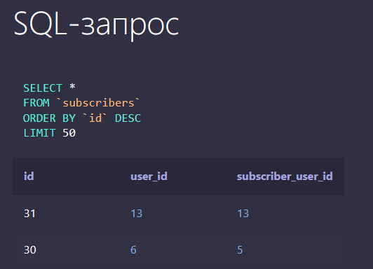
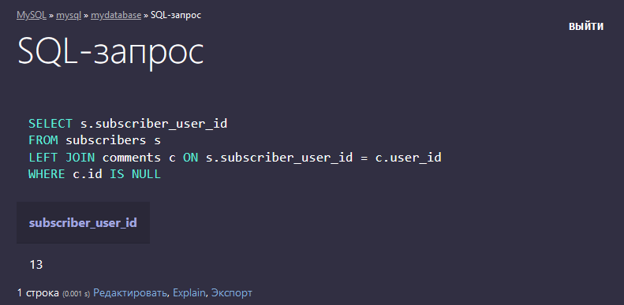
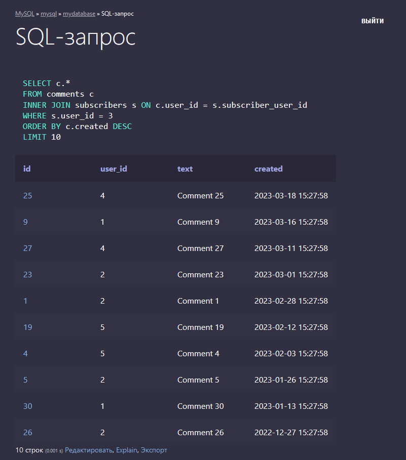
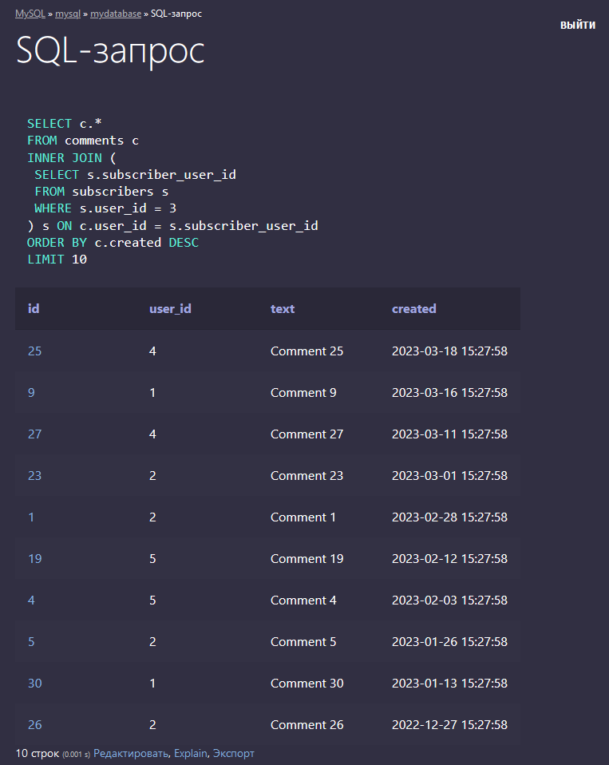

# SQL TEST ROOM 

## Как посмотреть список таблиц и их структуру в MySQL

`SHOW DATABASES;` - список баз данных

`SHOW TABLES [FROM db_name];` -  список таблиц в базе 

`SHOW COLUMNS FROM таблица [FROM db_name];` - список столбцов в таблице

`SHOW CREATE TABLE table_name;` - показать структуру таблицы в формате "CREATE TABLE"

`SHOW INDEX FROM tbl_name;` - список индексов

`SHOW GRANTS FOR user [FROM db_name];` - привилегии для пользователя.

`SHOW VARIABLES;` - значения системных переменных

`SHOW [FULL] PROCESSLIST;` - статистика по mysqld процессам

`SHOW STATUS;` - общая статистика

`SHOW TABLE STATUS [FROM db_name];` - статистика по всем таблицам в базе


## Запуск

В начале нужно создать директорию `mysql-data` и `postgres-data` в корне проекта.

Далее в директории с `docker-compose.yml`:
```
docker compose up
```

ps:
```
PS C:\Users\ponom\Documents\CODE\SQL_TEST_ROOM> docker compose ps
NAME                       IMAGE                  COMMAND                  SERVICE             CREATED              STATUS              PORTS
sql_test_room-adminer-1    adminer                "entrypoint.sh php -…"   adminer             About a minute ago   Up About a minute   0.0.0.0:8080->8080/tcp
sql_test_room-mysql-1      mysql:latest           "docker-entrypoint.s…"   mysql               About a minute ago   Up About a minute   0.0.0.0:3306->3306/tcp, 33060/tcp
sql_test_room-postgres-1   postgres:latest        "docker-entrypoint.s…"   postgres            About a minute ago   Up About a minute   0.0.0.0:5432->5432/tcp
sql_test_room-python-1     sql_test_room-python   "python ./while_true…"   python              About a minute ago   Up About a minute
```

Вход в контейнер с `mysql`, в моём случае это `sql_test_room-mysql-1`, команда выполняется в директории проекта с `docker-compose.yml`:
```
PS C:\Users\ponom\Documents\CODE\SQL_TEST_ROOM> docker exec -it sql_test_room-mysql-1 bash
```

Вход в `mysql`, пользователь `root`:
```
mysql -u root -p
example
```

Создание двух новых пользователей:
```
CREATE USER 'Ishmael'@'localhost' IDENTIFIED BY 'Ishmael_pass';
CREATE USER 'Quiet'@'%' IDENTIFIED BY 'Quiet_pass';
```

`Ishmael` - не сможет зайти с `adminer`, т.к. у него есть доступ только с `localhost`.

`Quiet` - сможет подключится из любого места в сети: `%`. Вместо `%` можно указать IP.

Создание БД:
```
CREATE DATABASE mydatabase;
```

Показать Базы Данных, которые может видеть текущий пользователь, в случае примера. это `root`:
```
mysql> SHOW DATABASES;
+--------------------+
| Database           |
+--------------------+
| information_schema |
| mydatabase         |
| mysql              |
| performance_schema |
| sys                |
+--------------------+
5 rows in set (0.00 sec)
```

Выбор БД `mydatabase`:
```
USE mydatabase;
```
Создание таблицы пользователей `users` с помощью команды `CREATE TABLE`:
```
CREATE TABLE users (
  id INT PRIMARY KEY,
  name TEXT
);
```
Показать таблицы в БД:
```
mysql> SHOW TABLES;
+----------------------+
| Tables_in_mydatabase |
+----------------------+
| users                |
+----------------------+
1 row in set (0.00 sec)
```

Создание таблицы подписчиков `subscribers` с помощью команды `CREATE TABLE`:
```
CREATE TABLE subscribers (
  user_id INT,
  subscriber_user_id INT,
  PRIMARY KEY (user_id, subscriber_user_id)
);
```

Создание таблицы комментариев `comments` с помощью команды `CREATE TABLE`:
```
CREATE TABLE comments (
  id INT PRIMARY KEY,
  user_id INT,
  text TEXT,
  created TIMESTAMP
);
```

Показать таблицы в БД:
```
mysql> SHOW FULL TABLES;
+----------------------+------------+
| Tables_in_mydatabase | Table_type |
+----------------------+------------+
| comments             | BASE TABLE |
| subscribers          | BASE TABLE |
| users                | BASE TABLE |
+----------------------+------------+
3 rows in set (0.00 sec)
```


Предоставление новому пользователю `Quiet` права на доступ к базе данных `mydatabase` с помощью команды `GRANT`:
```
GRANT ALL PRIVILEGES ON mydatabase.* TO 'Quiet'@'%';
```

Обновление привилегий с помощью команды `FLUSH PRIVILEGES`:
```
FLUSH PRIVILEGES;
```

Теперь БД доступна для `Quiet`:


## PYTHON 

Питон-скриптами создадим и будем управлять БД.

Контейнер питона собирается в `Dockerfile.python`.

`while_true.py` - да, это такой элегантный сопособ не давать контейнеру с питоном завершиться.

Вход в контейнер питона: 
```
docker exec -it sql_test_room-python-1 bash
```

`init_db.py` - скрипт для работы с БД.


## MYSQL


 
MySQL системные БД: 

`information_schema` - это база данных, которая содержит метаданные о других базах данных в системе MySQL. Она содержит информацию о таблицах, столбцах, индексах, хранимых процедурах, пользователях и многом другом. Эти метаданные могут быть использованы для отображения информации о базе данных и ее структуре.

`mysql` - это системная база данных MySQL, которая содержит информацию о привилегиях пользователей, конфигурации сервера, логах и других административных задачах. Она содержит таблицы, такие как user и db, которые хранят информацию о пользователях и базах данных, а также таблицы, используемые для проверки привилегий.

`performance_schema` - это база данных, которая содержит информацию о производительности системы MySQL. Она предоставляет доступ к информации о текущей активности в MySQL, такой как счетчики использования таблиц, индексов и запросов, а также информацию о блокировках и потоковых событиях.

`sys` - это новая база данных в MySQL, которая была введена в версии MySQL 5.7. Она предоставляет удобный интерфейс для доступа к информации в information_schema и performance_schema. Она также содержит представления и функции, которые облегчают администрирование и мониторинг базы данных. Например, в sys есть представление sys.processlist, которое содержит информацию о текущих запросах в MySQL.


## ADMINER 

Доступен по: http://localhost:8080

```
Версия MySQL: 8.0.32 с PHP-расширением MySQLi

ADMINER_DESIGN: pepa-linha-dark
```

## Использование для решения ACUTA-задачи

**Задача**

Есть таблицы: 
 - пользователи user(id INT, name TEXT), 
 - подписчики subscribers(user_id INT, subscriber_user_id INT)
 - комментарии commets(id INT, user_id INT, text TEXT, created TIMESTAMPTZ).

1) Напишите запрос, который бы вывел всех подписчиков без единого комментария.

2) Напишите запрос, который возвращает десять последних комментариев подписчиков заданного пользователя.

3) Перепишите запрос из задания 2, который работает эффективнее, если бы количество пользователей и их комментариев было очень большим (подзапрос LATERAL).

---

Для решения я создал БД `mydatabase`. Поля `id` с автоинкрементом. 

С помощью скрипта `value_add.py` я добавил первые 3 записи в таблицу `users`.

С помощью скрипта `random_values_add_to_tables.py` наполнил рандомными значениями таблицы:
```
('comments',)
('subscribers',)
('users',)
```

Далее добавил в `subscribers` строку `13 13` вручную.


---

**Решение**

1. Запрос, который бы вывел всех подписчиков без единого комментария.

```
SELECT s.subscriber_user_id 
FROM subscribers s
LEFT JOIN comments c ON s.subscriber_user_id = c.user_id 
WHERE c.id IS NULL;
```


2. Запрос, который возвращает десять последних комментариев подписчиков заданного пользователя.

```
SELECT c.*
FROM comments c
INNER JOIN subscribers s ON c.user_id = s.subscriber_user_id
WHERE s.user_id = 3
ORDER BY c.created DESC
LIMIT 10;
```



3. Запрос из задания 2, который работает эффективнее, если бы количество пользователей и их комментариев было очень большим (подзапрос LATERAL).

PS: Оператор LATERAL не поддерживается в MySQL.

```
SELECT c.*
FROM comments c
INNER JOIN (
 SELECT s.subscriber_user_id
 FROM subscribers s
 WHERE s.user_id = 3
) s ON c.user_id = s.subscriber_user_id
ORDER BY c.created DESC
LIMIT 10;
```



**Задача решена.**

## PostgreSQL


PostgreSQL

`SELECT datname FROM pg_database;` - Список баз данных в PostgreSQL с помощью оператора SELECT

`CREATE DATABASE outer_haven;` - Создать БД outer_haven

`docker exec -it sql_test_room-postgres-1 bash`

`psql -U postgres -d outer_haven`

`SELECT * FROM names;`

```
 id |      name       |         created_at         | number | description |                               key                
                
----+-----------------+----------------------------+--------+-------------+--------------------------------------------------
----------------
  1 | Big Boss        | 2023-06-02 14:13:25.476838 | 427281 | Описание    | 7e075b0184ea7269cda191c18c0960d29c52182460daa9605
fd08c2e312874cf
  2 | Ahab            | 2023-06-02 14:13:25.477878 | 653744 | Описание    | dbb47960ec8edb39a2863a3e0f049c3c1c9d4afdcf7d8cec0
ca15556e4e7e25e
  3 | Ishmael         | 2023-06-02 14:13:25.478076 | 798887 | Описание    | a9594bf40c5e91092d44767ad39167906419e8b4904aece30
fb491bcd4c98570
  4 | EVA             | 2023-06-02 14:13:25.478255 | 177499 | Описание    | d324548456b8aa8ccefbba9afb2e13268af0fcce1832241f9
80bde36b31cf618
  5 | Quiet           | 2023-06-02 14:13:25.47843  | 619266 | Описание    | 72460e3f6f7524b8465eeed874395881b07c5d847c1fdb6f6
4763e7e98a787fc
  6 | Shalashaka      | 2023-06-02 14:13:25.478621 | 533700 | Описание    | cf57924c6fee34a1e8a7a371b7b6fa98c385665e158b3c28d
3f6fe945767d052
  7 | Paz             | 2023-06-02 14:13:25.478816 | 765364 | Описание    | b47347bddfeef2ef4cead365256ce993b1c96526f0c65d713
8c1eb18f93eb49a
  8 | Dr. Strangelove | 2023-06-02 14:13:25.479001 | 544041 | Описание    | 1452adda30697a1b214d28159160a883b8e630bb6592ff967
992267056d32cb5
  9 | Benedict Miller | 2023-06-02 14:13:25.479181 | 903173 | Описание    | 25b41ee3d697f8c329b32711e0ba54be69330b373f3d6c400
f6eceb4346dd819
 10 | Eli             | 2023-06-02 14:13:25.479367 | 449873 | Описание    | 2a76ddb0df93d92f816db208a99126ac6276ea2bcb5c01c05
4037cb19adbda50
(10 rows)
```

`ALTER TABLE names ADD COLUMN role VARCHAR(50);`