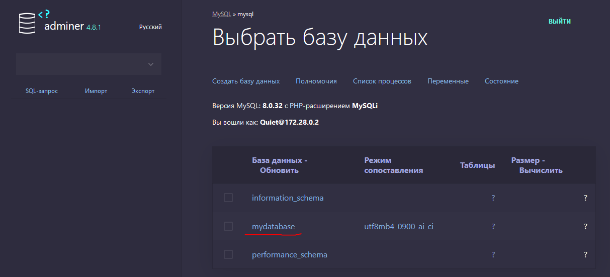

# SQL TEST ROOM 

## Как посмотреть список таблиц и их структуру в MySQL

`SHOW DATABASES;` - список баз данных
`SHOW TABLES [FROM db_name];` -  список таблиц в базе 
`SHOW COLUMNS FROM таблица [FROM db_name];` - список столбцов в таблице
`SHOW CREATE TABLE table_name;` - показать структуру таблицы в формате "CREATE TABLE"
`SHOW INDEX FROM tbl_name;` - список индексов
`SHOW GRANTS FOR user [FROM db_name];` - привилегии для пользователя.

`SHOW VARIABLES;` - значения системных переменных
`SHOW [FULL] PROCESSLIST;` - статистика по mysqld процессам
`SHOW STATUS;` - общая статистика
`SHOW TABLE STATUS [FROM db_name];` - статистика по всем таблицам в базе


## Запуск

В начале нужно создать директорию `mysql-data` в корне проекта.

Делее в директроии с `docker-compose.yml`:
```
docker compose up
```

ps:
```
PS C:\Users\ponom\Documents\CODE\SQL_TEST_ROOM> docker compose ps
NAME                      IMAGE               COMMAND                  SERVICE             CREATED             STATUS              PORTS
sql_test_room-adminer-1   adminer             "entrypoint.sh php -…"   adminer             7 minutes ago       Up 7 minutes        0.0.0.0:8080->8080/tcp
sql_test_room-mysql-1     mysql:latest        "docker-entrypoint.s…"   mysql               9 minutes ago       Up 7 minutes        0.0.0.0:3306->3306/tcp, 33060/tcp
```

Вход в контейнер с `mysql`, в моём случае это `sql_test_room-mysql-1`, команда выполняется в директории проекта с `docker-compose.yml`:
```
PS C:\Users\ponom\Documents\CODE\SQL_TEST_ROOM> docker exec -it sql_test_room-mysql-1 bash
```

Вход в `mysql`, пользователь `root`:
```
mysql -u root -p
example
```

Создание двух новых пользователей:
```
CREATE USER 'Ishmael'@'localhost' IDENTIFIED BY 'Ishmael_pass';
CREATE USER 'Quiet'@'%' IDENTIFIED BY 'Quiet_pass';
```

`Ishmael` - не сможет зайти с `adminer`, т.к. у него есть доступ только с `localhost`.

`Quiet` - сможет подключится из любого места в сети: `%`. Вместо `%` можно указать IP.

Создание БД:
```
CREATE DATABASE mydatabase;
```

```
mysql> SHOW DATABASES;
+--------------------+
| Database           |
+--------------------+
| information_schema |
| mydatabase         |
| mysql              |
| performance_schema |
| sys                |
+--------------------+
5 rows in set (0.00 sec)
```

Выбор БД `mydatabase`:
```
USE mydatabase;
```
Создание таблицы пользователей `users` с помощью команды `CREATE TABLE`:
```
CREATE TABLE users (
  id INT PRIMARY KEY,
  name TEXT
);
```
```
mysql> SHOW TABLES;
+----------------------+
| Tables_in_mydatabase |
+----------------------+
| users                |
+----------------------+
1 row in set (0.00 sec)
```

Создание таблицы подписчиков `subscribers` с помощью команды `CREATE TABLE`:
```
CREATE TABLE subscribers (
  user_id INT,
  subscriber_user_id INT,
  PRIMARY KEY (user_id, subscriber_user_id)
);
```

Создание таблицы комментариев `comments` с помощью команды `CREATE TABLE`:
```
CREATE TABLE comments (
  id INT PRIMARY KEY,
  user_id INT,
  text TEXT,
  created TIMESTAMP
);
```

```
mysql> SHOW FULL TABLES;
+----------------------+------------+
| Tables_in_mydatabase | Table_type |
+----------------------+------------+
| comments             | BASE TABLE |
| subscribers          | BASE TABLE |
| users                | BASE TABLE |
+----------------------+------------+
3 rows in set (0.00 sec)
```


Предоставление новому пользователю `Quiet` права на доступ к базе данных `mydatabase` с помощью команды `GRANT`:
```
GRANT ALL PRIVILEGES ON mydatabase.* TO 'Quiet'@'%';
```

Обновление привилегий с помощью команды `FLUSH PRIVILEGES`:
```
FLUSH PRIVILEGES;
```




## PYTHON 

Питон-скриптами создадим и будем управлять БД.

Контейнер питона собирается в `Dockerfile.python`.

`while_true.py` - да, это такой элегантный сопособ не давать контейнеру с питоном завершиться.

Вход в контейнер питона: 
```
docker exec -it sql_test_room-python-1 bash
```

`init_db.py` - скрипт для работы с БД.


## MYSQL


 
MySQL системные БД: 

`information_schema` - это база данных, которая содержит метаданные о других базах данных в системе MySQL. Она содержит информацию о таблицах, столбцах, индексах, хранимых процедурах, пользователях и многом другом. Эти метаданные могут быть использованы для отображения информации о базе данных и ее структуре.

`mysql` - это системная база данных MySQL, которая содержит информацию о привилегиях пользователей, конфигурации сервера, логах и других административных задачах. Она содержит таблицы, такие как user и db, которые хранят информацию о пользователях и базах данных, а также таблицы, используемые для проверки привилегий.

`performance_schema` - это база данных, которая содержит информацию о производительности системы MySQL. Она предоставляет доступ к информации о текущей активности в MySQL, такой как счетчики использования таблиц, индексов и запросов, а также информацию о блокировках и потоковых событиях.

`sys` - это новая база данных в MySQL, которая была введена в версии MySQL 5.7. Она предоставляет удобный интерфейс для доступа к информации в information_schema и performance_schema. Она также содержит представления и функции, которые облегчают администрирование и мониторинг базы данных. Например, в sys есть представление sys.processlist, которое содержит информацию о текущих запросах в MySQL.


## ADMINER 

Доступен по: http://localhost:8080

```
Версия MySQL: 8.0.32 с PHP-расширением MySQLi

ADMINER_DESIGN: pepa-linha-dark
```

